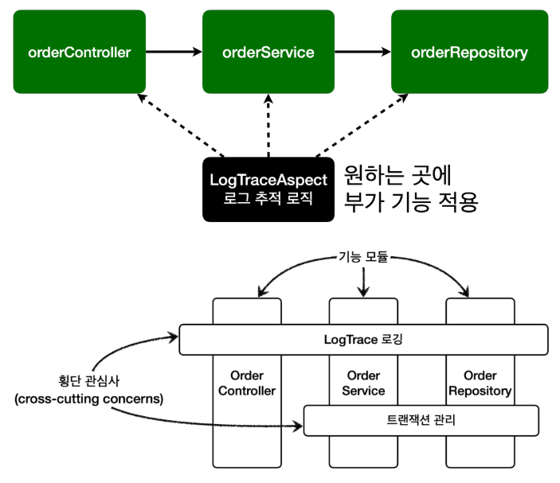

# AOP 소개 - 애스펙트
### 핵심 기능과 부가 기능을 분리
누군가는 이러한 부가 기능 도입의 문제점들을 해결하기 위해 오랜기간 고민해왔다.<br>
그 결과 부가 기능을 핵심 기능에서 분리하고 한 곳에서 관리하도록 했다.
그리고 해당 부가 기능을 어디에 적용할지 선택하는 기능도 만들었다.
이렇게 부가 기능과 부가 기능을 어디에 적용할지 선택하는 기능을 합해서 하나의 모듈로 만들었는데 이것이 바로 애스펙트(aspect)이다.
애스펙트는 쉽게 이야기해서 부가 기능과, 해당 부가 기능을 어디에 적용할지 정의한 것이다.
예를 들어서 로그 출력 기능을 모든 컨트롤러에 적용해라 라는 것이 정의되어 있다.

그렇다 바로 우리가 이전에 알아본 ```@Aspect``` 바로 그것이다.
그리고 스프링이 제공하는 어드바이저도 어드바이스(부가 기능)과 포인트컷(적용 대상)을 가지고 있어서 개념상 하나의 애스펙트이다.

애스펙트는 우리말로 해석하면 관점이라는 뜻인데, 이름 그대로 애플리케이션을 바라보는 관점을 하나하나의 기능에서 횡단 관심사(cross-cutting concerns) 관점으로 달리 보는 것이다.<br>
이렇게 **애스펙트를 사용한 프로그래밍 방식을 관점 지향 프로그래밍 AOP(Aspect-Oriented Programming)** 이라 한다.

참고로 AOP는 OOP를 대체하기 위한 것이 아니라 횡단 관심사를 깔끔하게 처리하기 어려운 OOP의 부족한 부분을 보조하는 목적으로 개발되었다.



<br>

### AspectJ 프레임워크

AOP의 대표적인 구현으로 AspectJ 프레임워크(https://www.eclipse.org/aspectj/)가 있다.
물론 스프링도 AOP를 지원하지만 대부분 AspectJ의 문법을 차용하고, AspectJ가 제공하는 기능의 일부만 제공한다.

AspectJ 프레임워크는 스스로를 다음과 같이 설명한다.
* 자바 프로그래밍 언어에 대한 완벽한 관점 지향 확장
* 횡단 관심사의 깔끔한 모듈화
  * 오류 검사 및 처리
  * 동기화
  * 성능 최적화(캐싱)
  * 모니터링 및 로깅