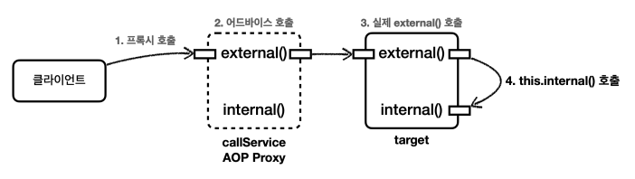

# 프록시와 내부 호출 - 문제

스프링은 프록시 방식의 AOP를 사용한다.
따라서 AOP를 적용하려면 항상 프록시를 통해서 대상 객체(Target)을 호출해야 한다.<br>
이렇게 해야 프록시에서 먼저 어드바이스를 호출하고, 이후에 대상 객체를 호출한다.<br>
만약 프록시를 거치지 않고 대상 객체를 직접 호출하게 되면 AOP가 적용되지 않고, 어드바이스도 호출되지 않는다.

AOP를 적용하면 스프링은 대상 객체 대신에 프록시를 스프링 빈으로 등록한다.<br>
따라서 스프링은 의존관계 주입시에 항상 프록시 객체를 주입한다.<br>
프록시 객체가 주입되기 때문에 대상 객체를 직접 호출하는 문제는 일반적으로 발생하지 않는다.<br>
하지만 대상 객체의 내부에서 메서드 호출이 발생하면 프록시를 거치지 않고 대상 객체를 직접 호출하는 문제가 발생한다.<br>
실무에서 반드시 한번은 만나서 고생하는 문제이기 때문에 꼭 이해하고 넘어가자.

예제를 통해서 내부 호출이 발생할 때 어떤 문제가 발생하는지 알아보자. 먼저 내부 호출이 발생하는 예제를 만들어보자.

> src/main/java/thespeace/springAop/internalcall/CallServiceV0.java<br>
> src/main/java/thespeace/springAop/internalcall/aop/CallLogAspect.java<br>
> test/java/thespeace/springAop/internalcall/CallServiceV0Test.java

<br>

### 테스트 코드 실행 결과 - external()
```
1. //프록시 호출
2. CallLogAspect : aop=void thespeace.springAop.internalcall.CallServiceV0.external()
3. CallServiceV0 : call external
4. CallServiceV0 : call internal
```



실행 결과를 보면 ```callServiceV0.external()```을 실행할 때는 프록시를 호출한다. 따라서 ```CallLogAspect``` 어드바이스가 호출된 것을 확인할 수 있다.<br>
그리고 AOP Proxy는 ```target.external()```을 호출한다.<br>
그런데 여기서 문제는 ```callServiceV0.external()``` 안에서 ```internal()``` 을 호출할 때 발생한다. 이때는 ```CallLogAspect``` 어드바이스가 호출되지 않는다.

자바 언어에서 메서드 앞에 별도의 참조가 없으면 ```this``` 라는 뜻으로 자기 자신의 인스턴스를 가리킨다.<br>
결과적으로 자기 자신의 내부 메서드를 호출하는 ```this.internal()``` 이 되는데, 여기서 ```this``` 는 실제 대상 객체 (target)의 인스턴스를 뜻한다.<br>
결과적으로 이러한 내부 호출은 프록시를 거치지 않는다. 따라서 어드바이스도 적용할 수 없다.

이번에는 외부에서 ```internal()``` 을 호출하는 테스트를 실행해보자.

<br>

### 테스트 코드 실행 결과 - internal()
```
CallLogAspect : aop=void thespeace.springAop.internalcall.CallServiceV0.internal()
CallServiceV0 : call internal
```


외부에서 호출하는 경우 프록시를 거치기 때문에 ```internal()```도 ```CallLogAspect``` 어드바이스가 적용된 것을 확인 할 수 있다.

<br>

## 프록시 방식의 AOP 한계
스프링은 프록시 방식의 AOP를 사용한다. 프록시 방식의 AOP는 메서드 내부 호출에 프록시를 적용할 수 없다.<br>
지금부터 이 문제를 해결하는 방법을 하나씩 알아보자.

> ### 참고<br>
> 실제 코드에 AOP를 직접 적용하는 AspectJ를 사용하면 이런 문제가 발생하지 않는다.
> 프록시를 통하는 것이 아니라 해당 코드에 직접 AOP 적용 코드가 붙어 있기 때문에 내부 호출과 무관하게 AOP를 적용할 수 있다.<br>
> 하지만 로드 타임 위빙 등을 사용해야 하는데, 설정이 복잡하고 JVM 옵션을 주어야 하는 부담이 있다.
> 그리고 지금부터 설명할 프록시 방식의 AOP에서 내부 호출에 대응할 수 있는 대안들도 있다.
> 
> 이런 이유로 AspectJ를 직접 사용하는 방법은 실무에서는 거의 사용하지 않는다.<br>
> 스프링 애플리케이션과 함께 직접 AspectJ 사용하는 방법은 스프링 공식 메뉴얼을 참고하자.<br>
> https://docs.spring.io/spring-framework/docs/current/reference/html/core.html#aop-usingaspectj